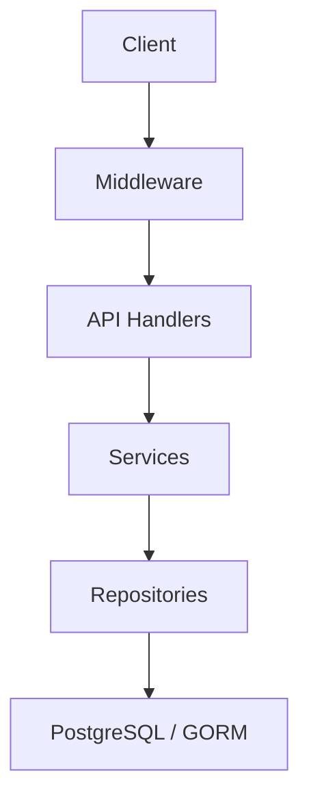

# System Architecture Overview

This document provides a high-level technical overview of the backend's architecture, design patterns, and request lifecycle.

## 🏛 Overall Design

The system follows a classic N-Tier architecture, heavily utilizing interfaces and generics to promote testability and maintainability.

### Layer Responsibilities

1.  **Middleware (`internal/middleware`)**: Handles cross-cutting concerns like Authentication, ID injection for RLS, Logging, and Recovery.
2.  **API Handlers (`internal/api`)**: Responsible for parsing requests, basic validation (via `pkg/validator`), and calling the appropriate service.
3.  **Services (`internal/services`)**: Contains the core business logic. This layer coordinates multiple repositories and handles transaction boundaries.
4.  **Repositories (`internal/repository`)**: Provides an abstraction over the data source. It uses GORM and handles RLS injection through the context.
5.  **Entities (`internal/entities`)**: Domain models that map directly to database tables.

---

## 🔑 Key Architectural Patterns

### 1. Multi-Tenant Row-Level Security (RLS)
Data isolation is enforced at the database level using PostgreSQL RLS. The `app.current_org_id` and `app.current_org_path` session variables are set by the `RLSPlugin` (in `pkg/database`) based on the `Identity` found in the request context.
See [Multi-Tenant Architecture](file:///c:/Users/User/Desktop/golang-backend-boilerplate/docs/multi_tenant_architecture.md) and [Security & Identity](file:///c:/Users/User/Desktop/golang-backend-boilerplate/docs/security_and_identity.md) for details.

### 2. Generic Base Repository
The `BaseRepository[T]` provides a consistent CRUD interface for all entities, reducing boilerplate and ensuring that security checks (like identifier sanitization) are applied consistently.
See [Repository Layer](file:///c:/Users/User/Desktop/golang-backend-boilerplate/docs/repository_layer.md) and [Advanced Repository Patterns](file:///c:/Users/User/Desktop/golang-backend-boilerplate/docs/advanced_repository_patterns.md) for details.

### 3. Controller Factory & Service Injection
To manage dependencies, the application uses a centralized service initialization (`internal/services/init.go`) and a controller factory (`internal/api/controller_factory.go`). Services are injected into controllers, making them easy to mock during testing.

### 4. Consistent Error Wrapping
Errors are wrapped with context using `%w` across all layers, ensuring full traceability of issues from the repository up to the API handler.

---

## 🔄 Request Lifecycle

1.  **Incoming Request**: A client sends an HTTP request.
2.  **Auth Middleware**: Extracts the JWT or Service Token, validates it, and constructs an `Identity` object.
3.  **Context Injection**: The `Identity` is injected into the Go `context.Context`.
4.  **Routing**: The request is routed to the correct Controller method.
5.  **Service Call**: The Controller calls a Service method, passing the `context.Context`.
6.  **Repository Execution**:
    -   The Repository retrieves the `*gorm.DB` instance.
    -   The `RLSPlugin` extracts the `Identity` from the context.
    -   `SET LOCAL` commands are executed in the Postgres transaction to set RLS variables.
    -   Postgres executes the query, automatically filtering data based on RLS policies.
7.  **Response**: The result flows back through the layers and is returned as JSON via the Gin context.
