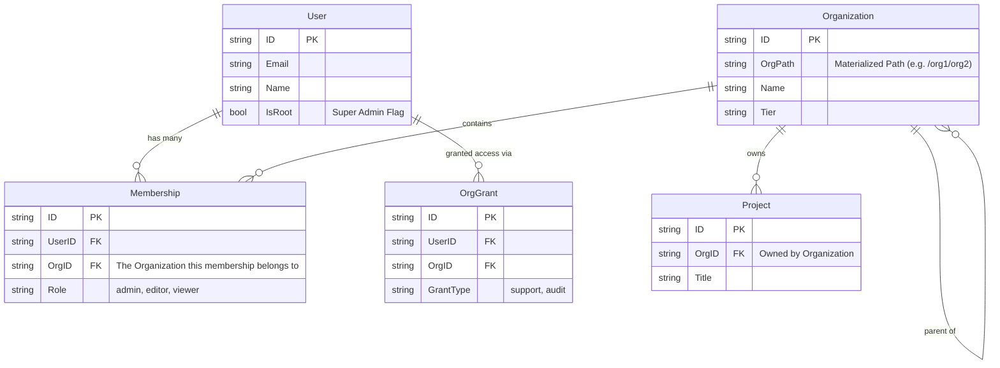

# Database Schema & Entity Relationships

This document visualizes the core database schema and explains the relationships between the main entities. 

## 🗺 Entity Relationship Diagram (ERD)

Here is a simplified view of how the core tables relate to each other.

## 📝 Table Descriptions

### 1. `users` (Global)
*   **Purpose**: Represents a human being or service account.
*   **Scope**: Global. Users are not "inside" an organization directly; they are linked to them.
*   **Key Fields**:
    *   `email`: Unique identifier for login.
    *   `is_root`: If true, this user bypasses all RLS checks (System Admin).

### 2. `organizations` (Tenant)
*   **Purpose**: Represents a company, division, or team.
*   **Scope**: Hierarchical.
*   **Key Fields**:
    *   `org_path`: The critical field for hierarchy. Example: `/google/engineering/backend`.
    *   `parent_id`: Points to the parent organization.

### 3. `memberships` (Tenanted Link)
*   **Purpose**: Connects a `User` to an `Organization`.
*   **Scope**: Tenanted. A membership belongs to an organization.
*   **Key Fields**:
    *   `role`: The user's permission level within *this specific* organization.

### 4. `org_grants` (Cross-Tenant Link)
*   **Purpose**: Allows a user to access an organization *temporarily* or for specific reasons (like Support) without being a full member.

## 🔒 Row-Level Security (RLS) Note in Schema

All tables except `users` have `org_id` and `org_path` columns (inherited from `BaseEntity`).
*   **Postgres RLS Policy**: checks if `current_setting('app.current_org_path')` is a prefix of the row's `org_path`.
*   This means a query on `projects` automatically adds `WHERE org_path LIKE '/my/org/%'` without you writing it!
