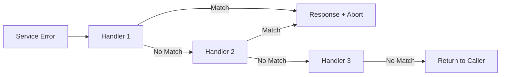

# Error Handling System

This document explains the standardized error handling system used throughout the application, including error types, response formats, and best practices.

## Overview

The application uses a custom error system that provides:
- **Consistent API responses** - All errors follow the same JSON structure
- **Proper HTTP status codes** - Each error type maps to an appropriate status
- **Error wrapping** - Original errors are preserved for debugging
- **Stack traces** - Automatically captured in development mode
- **Validation details** - Support for detailed validation error information

---

## Error Types and Status Codes

| Error Type | Status Code | Code | Use Case |
|------------|:-----------:|------|----------|
| BadRequestError | 400 | `BAD_REQUEST` | Malformed requests, invalid parameters |
| UnauthorizedError | 401 | `UNAUTHORIZED` | Missing or invalid authentication |
| ForbiddenError | 403 | `FORBIDDEN` | Authenticated but insufficient permissions |
| NotFoundError | 404 | `NOT_FOUND` | Resource does not exist |
| ConflictError | 409 | `CONFLICT` | Resource state conflict (e.g., duplicate) |
| ValidationError | 422 | `VALIDATION_ERROR` | Request data fails validation |
| RateLimitError | 429 | `TOO_MANY_REQUESTS` | Rate limit exceeded |
| InternalServerError | 500 | `INTERNAL_SERVER_ERROR` | Unexpected server errors |

---

## AppError Structure

**Location**: `pkg/errors/index.go`

```go
type AppError struct {
    StatusCode       int    `json:"-"`         // HTTP status code (not in JSON)
    Code             string `json:"code"`       // Machine-readable error code
    Message          string `json:"message"`    // Human-readable message
    Type             string `json:"type"`       // Error type classification
    Stack            string `json:"stack,omitempty"`    // Stack trace (dev only)
    ValidationDetails any    `json:"details,omitempty"`  // Validation details
    Err              error  `json:"-"`          // Wrapped original error
}
```

---

## Response Formats

### Success Response

```json
{
    "success": true,
    "message": "User created successfully",
    "data": {
        "id": "user_123",
        "email": "user@example.com"
    }
}
```

### Error Response

```json
{
    "success": false,
    "data": null,
    "error": {
        "code": "NOT_FOUND",
        "message": "User with ID 123 not found",
        "type": "NotFoundError"
    }
}
```

### Validation Error with Details

```json
{
    "success": false,
    "data": null,
    "error": {
        "code": "VALIDATION_ERROR",
        "message": "Invalid input data",
        "type": "ValidationError",
        "details": {
            "email": "Invalid email format",
            "password": "Must be at least 8 characters"
        }
    }
}
```

---

## Creating Errors

### Basic Error Creation

```go
import "ovmsa-be/pkg/errors"

// Simple error
return errors.NotFound(nil, "User not found")

// Wrapping an existing error
if err := db.Query(); err != nil {
    return errors.InternalServerError(err, "Database query failed")
}
```

### All Error Constructors

```go
// 400 Bad Request
errors.BadRequest(err, "Invalid query parameter")

// 401 Unauthorized
errors.Unauthorized(err, "Invalid API key")

// 403 Forbidden
errors.Forbidden(err, "Access denied to this resource")

// 404 Not Found
errors.NotFound(err, "User not found")

// 409 Conflict
errors.Conflict(err, "Email already registered")

// 422 Validation Error
errors.ValidationError(err, "Invalid input")

// 422 Validation Error with Details
errors.ValidationErrorWithDetails(nil, "Validation failed", map[string]string{
    "email": "Invalid email format",
    "age":   "Must be positive",
})

// 429 Too Many Requests
errors.TooManyRequests(nil, "Rate limit exceeded")

// 500 Internal Server Error
errors.InternalServerError(err, "Database connection failed")
```

---

## Using Response Helpers

**Location**: `pkg/response/index.go`

Response helpers provide a convenient way to send error responses from handlers.

### In Handlers

```go
import "ovmsa-be/pkg/response"

func GetUser(c *gin.Context) {
    user, err := service.GetUser(id)
    if err != nil {
        response.NotFoundResponse(c, err, "User not found")
        return
    }
    
    c.JSON(200, response.Success("User retrieved", user))
}
```

### Available Response Functions

```go
// Success responses
response.Success("Operation completed", data)

// Error responses
response.BadRequestResponse(c, err, "Invalid request")
response.UnauthorizedResponse(c, err, "Invalid token")
response.ForbiddenResponse(c, err, "Access denied")
response.NotFoundResponse(c, err, "Resource not found")
response.ConflictResponse(c, err, "Resource already exists")
response.ValidationErrorResponse(c, err, "Invalid input")
response.ValidationErrorResponseWithDetails(c, err, "Invalid input", details)
response.TooManyRequestsResponse(c, err, "Rate limit exceeded")
response.InternalServerErrorResponse(c, err, "Something went wrong")

// Generic error handler (detects AppError automatically)
response.Error(c, err)
```

---

## Error Handler Chain (Chain of Responsibility)

**Location**: `pkg/helpers/errors.go`

The error handler chain allows you to process service errors through a series of handlers, mapping specific errors to appropriate HTTP responses.

### How It Works



### Setting Up a Chain

```go
import (
    "ovmsa-be/pkg/helpers"
    "ovmsa-be/pkg/response"
    "gorm.io/gorm"
)

func PrepareAuthChain() *helpers.ErrorHandlerChain {
    return helpers.NewErrorHandlerChain().
        Add(helpers.NewSpecificErrorHandler(gorm.ErrRecordNotFound, 404, "User not found")).
        Add(helpers.NewSpecificErrorHandler(ErrInvalidCredentials, 401, "Invalid email or password")).
        Add(helpers.NewSpecificErrorHandler(ErrUserDisabled, 403, "Account is disabled"))
}
```

### Using in Controllers

```go
func (ctrl *AuthController) Login(c *gin.Context) {
    result, err := ctrl.service.Login(ctx, req.Email, req.Password)
    
    // Try to handle known errors through the chain
    if handled, _ := helpers.HandleServiceError(c, err, ctrl.errorChain); handled {
        return // Error was handled and response sent
    }
    
    // Unexpected error - return as internal server error
    if err != nil {
        response.InternalServerErrorResponse(c, err, "Login failed")
        return
    }
    
    c.JSON(200, response.Success("Login successful", result))
}
```

### Benefits

1. **Centralized error mapping** - Define error-to-response mapping once
2. **Clean handlers** - Controllers don't need switch statements for errors
3. **Extensible** - Add new handlers without modifying existing code
4. **Testable** - Each handler can be tested independently

---

## Error Handling Patterns

### Pattern 1: Service Layer Errors

Services should return wrapped errors with context:

```go
func (s *UserService) GetByID(ctx context.Context, id string) (*entities.User, error) {
    user, err := s.repo.FindByID(ctx, id, nil)
    if err != nil {
        if errors.Is(err, gorm.ErrRecordNotFound) {
            return nil, errors.NotFound(err, "User not found")
        }
        return nil, errors.InternalServerError(err, "Failed to fetch user")
    }
    return user, nil
}
```

### Pattern 2: Controller Error Handling

Controllers use response helpers or error chains:

```go
func (ctrl *UserController) Get(c *gin.Context) {
    id := c.Param("id")
    
    user, err := ctrl.service.GetByID(ctx, id)
    if err != nil {
        response.Error(c, err)  // Handles AppError automatically
        return
    }
    
    c.JSON(200, response.Success("User found", user))
}
```

### Pattern 3: Wrapping External Errors

Always wrap errors from external packages:

```go
import (
    "ovmsa-be/pkg/errors"
    "github.com/lib/pq"
)

func (s *Service) Create(ctx context.Context, item *Item) error {
    if err := s.db.Create(item).Error; err != nil {
        // Check for PostgreSQL unique constraint violation
        var pqErr *pq.Error
        if errors.As(err, &pqErr) && pqErr.Code == "23505" {
            return errors.Conflict(err, "Item already exists")
        }
        return errors.InternalServerError(err, "Failed to create item")
    }
    return nil
}
```

---

## Error Utilities

### Checking Error Types

```go
import appErrors "ovmsa-be/pkg/errors"

// Check if error is a specific type
if appErrors.Is(err, "ValidationError") {
    // Handle validation error
}

// Convert to AppError for inspection
if appErr, ok := appErrors.AsAppError(err); ok {
    statusCode := appErr.StatusCode
    errorCode := appErr.Code
}
```

### Using Go's errors Package

```go
import "errors"

// Check if wrapped error matches
if errors.Is(err, gorm.ErrRecordNotFound) {
    // Handle not found
}

// Extract specific error type
var appErr *appErrors.AppError
if errors.As(err, &appErr) {
    // Use appErr
}
```

---

## Stack Traces

Stack traces are automatically captured when creating errors, but only in non-production environments.

**Development Output**:
```json
{
    "error": {
        "code": "NOT_FOUND",
        "message": "User not found",
        "type": "NotFoundError",
        "stack": "/app/internal/services/user.go:45\n/app/internal/api/controllers/user.go:32\n"
    }
}
```

**Production Output**:
```json
{
    "error": {
        "code": "NOT_FOUND",
        "message": "User not found",
        "type": "NotFoundError"
    }
}
```

This keeps production responses smaller and prevents exposing implementation details.

---

## Best Practices

### Do

```go
// Wrap errors with context
return nil, errors.InternalServerError(err, "Failed to process payment")

// Use specific error types
return nil, errors.NotFound(nil, "Order not found")

// Include validation details
return nil, errors.ValidationErrorWithDetails(nil, "Invalid input", map[string]string{
    "amount": "Must be positive",
})

// Use error chains for consistent mapping
handled, _ := helpers.HandleServiceError(c, err, errorChain)
```

### Don't

```go
// Don't return raw errors
return nil, err

// Don't use wrong error types
return nil, errors.NotFound(nil, "Access denied")  // Should be Forbidden

// Don't expose internal details in production
return nil, errors.BadRequest(nil, fmt.Sprintf("SQL error: %v", sqlErr))

// Don't skip error handling
result, _ := service.DoSomething()  // Ignoring error
```

---

## Logging

All error responses are automatically logged with relevant context:

```
ERROR Request error  requestID=abc-123  statusCode=404  errorCode=NOT_FOUND  errorType=NotFoundError  message=User not found
```

For internal server errors, the original error is logged:

```
ERROR Internal server error  requestID=abc-123  error=connection refused
```
