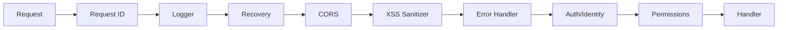

# Middleware System

This document provides a comprehensive overview of the middleware chain, explaining each middleware's purpose, order, and implementation details.

## Middleware Chain Overview

The application uses a carefully ordered middleware chain to process every HTTP request. The order is critical for proper security and functionality.



### Execution Order

| Order | Middleware | Purpose |
|:-----:|------------|---------|
| 1 | `requestid.New()` | Generate unique request ID |
| 2 | `LoggerMiddleware()` | Structured request logging |
| 3 | `gin.Recovery()` | Panic recovery |
| 4 | `CORSMiddleware()` | CORS and security headers |
| 5 | `XSSSanitizer()` | Input sanitization |
| 6 | `Error404n500Handler()` | 404/500 error handling |
| 7 | `AuthMiddleware()` | Authentication and identity extraction |
| 8 | `EnforcePermissions()` | Route-level authorization |

---

## 1. Request ID Middleware

**Location**: `github.com/gin-contrib/requestid`

**Purpose**: Generates a unique identifier for each request, enabling request tracing across logs and services.

**Behavior**:
- Generates a UUID for each incoming request
- Stores the ID in both the Gin context and response headers (`X-Request-Id`)
- Can be overridden by client-provided `X-Request-Id` header (if configured)

**Usage in Logs**:
```go
requestID := requestid.Get(c)
logger.Info("Processing request", "requestID", requestID)
```

---

## 2. Logger Middleware

**Location**: `internal/middleware/logger.go`

**Purpose**: Provides structured logging for all HTTP requests with latency tracking.

**Logged Information**:
- Request ID (from previous middleware)
- Client IP address
- HTTP method and path
- Response status code
- Request latency
- User agent
- Error count

**Example Log Output**:
```
INFO  Request completed  requestID=abc-123  clientIP=192.168.1.1  method=POST  path=/api/users  status=201  latency=45ms  userAgent=Mozilla/5.0  errorCount=0
```

**Error Logging**:
When errors occur during request processing, they are logged separately:
```
ERROR Request errors  requestID=abc-123  errors="validation failed"
```

---

## 3. Recovery Middleware

**Location**: `github.com/gin-gonic/gin` (built-in)

**Purpose**: Catches panics in any handler and prevents the server from crashing.

**Behavior**:
- Intercepts panics during request processing
- Returns a 500 Internal Server Error to the client
- Logs the panic details (stack trace in development mode)
- Ensures the server continues running

**Important**: Always place this early in the chain to catch panics from all subsequent middleware.

---

## 4. CORS Middleware

**Location**: `internal/middleware/cors.go`

**Purpose**: Handles Cross-Origin Resource Sharing (CORS) and adds security headers.

**Configuration**:
Set allowed origins in your `.env` file or config:
```go
ALLOWED_ORIGINS=http://localhost:3000,https://myapp.com
```

**CORS Headers Set**:
| Header | Value |
|--------|-------|
| `Access-Control-Allow-Origin` | Matched origin (if allowed) |
| `Access-Control-Allow-Credentials` | `true` |
| `Access-Control-Allow-Headers` | Content-Type, Authorization, etc. |
| `Access-Control-Allow-Methods` | GET, POST, PUT, DELETE, OPTIONS, PATCH |
| `Access-Control-Max-Age` | 86400 (24 hours) |

**Security Headers Added**:
| Header | Value | Purpose |
|--------|-------|---------|
| `X-Content-Type-Options` | `nosniff` | Prevents MIME type sniffing |
| `X-XSS-Protection` | `1; mode=block` | Enables browser XSS filter |
| `X-Frame-Options` | `DENY` | Prevents clickjacking |
| `Strict-Transport-Security` | `max-age=31536000; includeSubDomains` | Enforces HTTPS |

**Preflight Handling**:
OPTIONS requests (preflight) are automatically handled and return 204 No Content.

---

## 5. XSS Sanitizer Middleware

**Location**: `internal/middleware/XSSSanitizer.go`

**Purpose**: Sanitizes input parameters to prevent Cross-Site Scripting (XSS) attacks.

**Behavior**:

1. **Content-Type Enforcement**:
   POST, PUT, and PATCH requests must use `application/json` content type.
   ```json
   // Returns 415 Unsupported Media Type if not JSON
   { "error": "JSON required" }
   ```

2. **Path Parameter Sanitization**:
   All path parameters are stripped of HTML/Script tags.
   ```
   /users/<script>alert(1)</script>  →  /users/alert(1)
   ```

3. **Query Parameter Sanitization**:
   All query parameters are sanitized.
   ```
   ?name=<script>alert(1)</script>  →  ?name=alert(1)
   ```

**Library**: Uses `bluemonday.StrictPolicy()` which strips all HTML tags.

---

## 6. Error Handler Middleware

**Location**: `internal/middleware/errorHandler.go`

**Purpose**: Provides consistent error responses for 404 and 500 errors.

**Behavior**:

| Scenario | Status | Response |
|----------|--------|----------|
| Route not found | 404 | `{"status": "error", "message": "The requested endpoint was not found"}` |
| Internal error (panic/unknown) | 500 | `{"status": "error", "message": "Internal Server Error"}` |

**Note**: This middleware runs after the main handler to catch any unhandled errors.

---

## 7. Auth Middleware (Identity Extraction)

**Location**: `internal/middleware/identity.go`

**Purpose**: Extracts and validates user/service identity from authentication tokens.

### Supported Authentication Methods

#### A. User JWT Authentication

**Format**: `Authorization: Bearer <JWT>`

**Validation Steps**:
1. Parse JWT and extract `kid` (key ID) from header
2. Look up signing key in database (with caching)
3. Verify signature and claims
4. Check token expiration
5. Verify session still exists (immediate revocation check)
6. Verify user/membership status hasn't changed (identity consistency)

**Caches Used**:
| Cache | TTL | Purpose |
|-------|-----|---------|
| `signingKeyCache` | 5 min | Valid signing keys |
| `invalidKeyCache` | 1 min | Known-bad key IDs |
| `sessionCache` | 30 sec | Session existence |
| `identityCheckCache` | 1 min | User/membership validation |

#### B. External Service Token

**Format**: `Authorization: Bearer requesterID:timestamp:nonce:signature`

**Example**: `Authorization: Bearer my-service:1704067200:abc123:hmac_signature`

**Validation Steps**:
1. Parse 4-part token format
2. Check replay cache (prevent duplicate requests)
3. Look up requester configuration
4. Validate timestamp (within 5-minute window)
5. Verify HMAC-SHA256 signature
6. Add to replay cache

**Configuration** (`configs/requesters.go`):
```go
var ValidRequesters = map[string]Requester{
    "my-service": {
        ID:        "my-service",
        SecretKey: "super-secret-key",
        Role:      "service-admin",
    },
}
```

### Identity Object

After successful authentication, an `Identity` object is stored in the context:

```go
type Identity struct {
    UserID    string
    SessionID string
    OrgID     string
    OrgPath   string
    Role      string
    IsRoot    bool
    Attributes map[string]any  // For ABAC
}
```

**Accessing Identity**:
```go
identity := entities.GetIdentity(c.Request.Context())
// or
identityVal, _ := c.Get("identity")
identity := identityVal.(*entities.Identity)
```

---

## 8. Permissions Middleware

**Location**: `internal/middleware/permissions.go`

**Purpose**: Enforces route-level authorization based on protection strategy.

### Protection Strategies

| Strategy | Constant | Description |
|----------|----------|-------------|
| Unprotected | `UNPROTECTED` | No authentication required |
| JWT Only | `JWT` | Authentication required, no role check |
| RBAC | `RBAC_AUTH` | Role-based access control |
| ABAC | `ABAC_AUTH` | Attribute-based access control |
| Combined | `COMBINED_AUTH` | Both RBAC and ABAC must pass |

### How It Works

The `EnforcePermissions` function is applied per-route (not globally). It checks:

1. **UNPROTECTED**: Skips all checks
2. **JWT**: Verifies identity exists (authentication only)
3. **RBAC_AUTH**: Checks if `identity.Role` is in `AllowedRoles`
4. **ABAC_AUTH**: Checks if `identity.Attributes` matches `RequiredAttributes`
5. **COMBINED_AUTH**: Both RBAC and ABAC must pass

**Error Responses**:
| Scenario | Status | Message |
|----------|--------|---------|
| No identity | 401 | "Authentication required" |
| Invalid identity | 401 | "Invalid authentication" |
| RBAC failed | 403 | "Insufficient permissions: role not authorized" |
| ABAC failed | 403 | "Insufficient permissions: required attributes not met" |

See [permissions.md](permissions.md) for detailed usage examples.

---

## Rate Limiting Middleware

**Location**: `internal/middleware/rate_limit.go`

**Purpose**: Limits requests per IP address to prevent abuse.

**Configuration**:
```env
RATE_LIMIT_ENABLED=true
RATE_LIMIT_REQUESTS_PER_MINUTE=60
```

**Implementation**:
- Uses LRU cache with 10,000 IP capacity
- 2-minute TTL for idle IPs
- Thread-safe with mutex per IP
- Sliding window algorithm

**Response When Limited**:
```json
{
  "status": "error",
  "message": "Rate limit exceeded. Please try again later."
}
```

**Note**: This middleware is not in the default chain. Add it via `router.Use(RateLimitMiddleware())` if needed.

---

## Adding Custom Middleware

### Step 1: Create the Middleware

```go
// internal/middleware/my_middleware.go
package middleware

import (
    "github.com/gin-gonic/gin"
    "ovmsa-be/pkg/logger"
)

func MyMiddleware() gin.HandlerFunc {
    return func(c *gin.Context) {
        // Pre-processing
        logger.Info("Before handler")
        
        // Call next middleware/handler
        c.Next()
        
        // Post-processing
        logger.Info("After handler")
    }
}
```

### Step 2: Register in Chain

```go
// internal/middleware/index.go
func SetupMiddleware(router *gin.Engine) {
    router.Use(requestid.New())
    // ... other middleware ...
    router.Use(MyMiddleware())  // Add here
}
```

### Best Practices

1. **Order Matters**: Place authentication middleware before authorization middleware
2. **Call `c.Next()`**: Always call this to continue the chain
3. **Use `c.Abort()`**: Stop the chain when rejecting requests
4. **Log Appropriately**: Use structured logging with context
5. **Handle Errors**: Set appropriate HTTP status codes

---

## Cache Management

The `PurgeCaches()` function clears all in-memory caches:

```go
middleware.PurgeCaches()
```

This is primarily used in tests to ensure a clean state between test cases.
