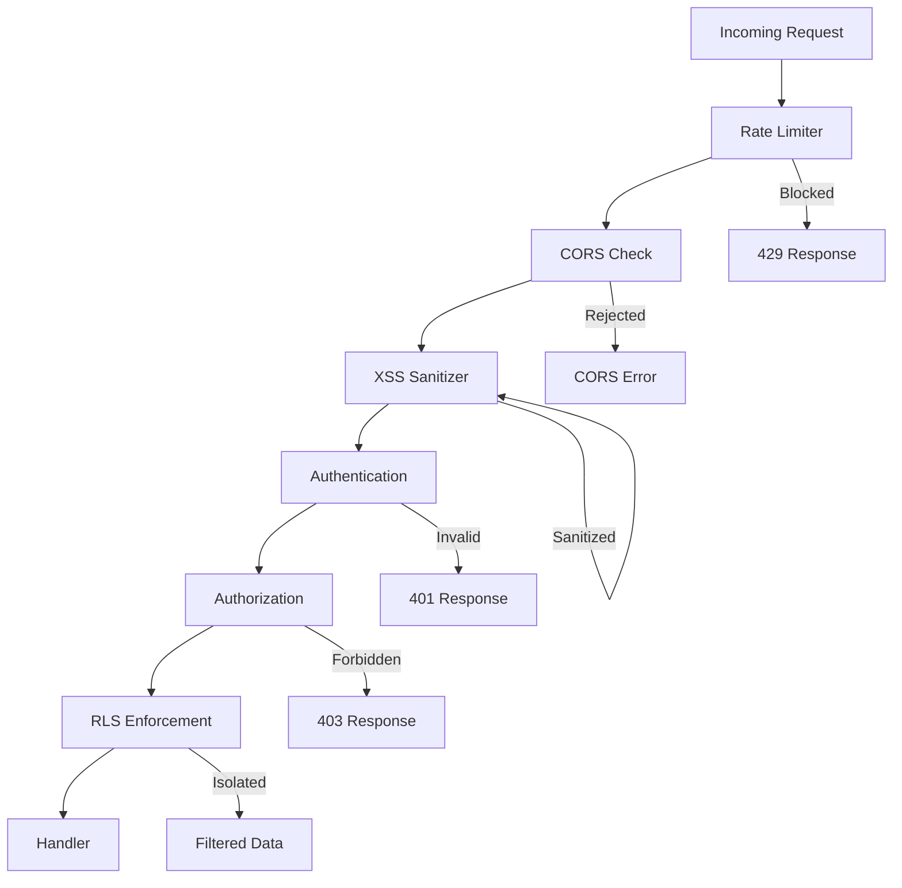

# Security Hardening

This document covers the security features implemented in the application, including XSS protection, CORS configuration, rate limiting, security headers, and best practices.

## Security Overview



---

## XSS Protection

**Location**: `internal/middleware/XSSSanitizer.go`

Cross-Site Scripting (XSS) attacks inject malicious scripts into web pages. The application uses the `bluemonday` library to sanitize input.

### How It Works

```go
var strictPolicy = bluemonday.StrictPolicy()

func XSSSanitizer() gin.HandlerFunc {
    return func(c *gin.Context) {
        // 1. Content-Type Check
        if (c.Request.Method == "POST" || c.Request.Method == "PUT" || c.Request.Method == "PATCH") &&
            !strings.Contains(c.GetHeader("Content-Type"), "application/json") {
            c.AbortWithStatusJSON(415, gin.H{"error": "JSON required"})
            return
        }

        // 2. Sanitize Path Params
        for i := range c.Params {
            c.Params[i].Value = strictPolicy.Sanitize(c.Params[i].Value)
        }

        // 3. Sanitize Query Params
        queries := c.Request.URL.Query()
        for key, values := range queries {
            for i := range values {
                queries[key][i] = strictPolicy.Sanitize(values[i])
            }
        }
        c.Request.URL.RawQuery = queries.Encode()

        c.Next()
    }
}
```

### Protection Layers

| Layer | What It Protects | How |
|-------|------------------|-----|
| Content-Type | Request body injection | Rejects non-JSON bodies for POST/PUT/PATCH |
| Path Params | URL path injection | Strips HTML/script tags from path values |
| Query Params | URL query injection | Strips HTML/script tags from query values |

### Examples

| Attack Vector | Sanitized Result |
|---------------|------------------|
| `/users/<script>alert(1)</script>` | `/users/alert(1)` |
| `?name=` | `?name=` |
| `?redirect=javascript:alert(1)` | `?redirect=alert(1)` |

### Configuration

XSS sanitization is always enabled and applied globally. No configuration needed.

---

## CORS (Cross-Origin Resource Sharing)

**Location**: `internal/middleware/cors.go`

CORS controls which domains can access the API from browsers.

### Configuration

Set allowed origins in environment configuration:

```env
# .env
ALLOWED_ORIGINS=http://localhost:3000,https://myapp.com,https://admin.myapp.com
```

Or use wildcard for development:

```env
ALLOWED_ORIGINS=*
```

### How It Works

```go
func CORSMiddleware() gin.HandlerFunc {
    return func(c *gin.Context) {
        origin := c.Request.Header.Get("Origin")
        
        // Check if origin is allowed
        for _, allowedOrigin := range allowedOrigins {
            if allowedOrigin == "*" || allowedOrigin == origin {
                c.Writer.Header().Set("Access-Control-Allow-Origin", origin)
                c.Writer.Header().Set("Access-Control-Allow-Credentials", "true")
                break
            }
        }
        
        // Set CORS headers
        c.Writer.Header().Set("Access-Control-Allow-Headers", "Content-Type, Authorization, ...")
        c.Writer.Header().Set("Access-Control-Allow-Methods", "GET, POST, PUT, DELETE, OPTIONS, PATCH")
        c.Writer.Header().Set("Access-Control-Max-Age", "86400")
        
        // Handle preflight
        if c.Request.Method == "OPTIONS" {
            c.AbortWithStatus(204)
            return
        }
        
        c.Next()
    }
}
```

### CORS Headers

| Header | Value | Purpose |
|--------|-------|---------|
| `Access-Control-Allow-Origin` | Matched origin | Specifies allowed origin |
| `Access-Control-Allow-Credentials` | `true` | Allows cookies/auth headers |
| `Access-Control-Allow-Headers` | List | Allowed request headers |
| `Access-Control-Allow-Methods` | List | Allowed HTTP methods |
| `Access-Control-Max-Age` | `86400` | Preflight cache duration |

### Security Headers

The CORS middleware also adds security headers:

| Header | Value | Purpose |
|--------|-------|---------|
| `X-Content-Type-Options` | `nosniff` | Prevents MIME type sniffing |
| `X-XSS-Protection` | `1; mode=block` | Enables browser XSS filter |
| `X-Frame-Options` | `DENY` | Prevents clickjacking |
| `Strict-Transport-Security` | `max-age=31536000; includeSubDomains` | Enforces HTTPS |

---

## Rate Limiting

**Location**: `internal/middleware/rate_limit.go`

Rate limiting prevents abuse by limiting requests per IP address.

### Configuration

```env
RATE_LIMIT_ENABLED=true
RATE_LIMIT_REQUESTS_PER_MINUTE=60
```

### How It Works

```go
var rateLimitCache = expirable.NewLRU[string, *rateLimitEntry](10_000, nil, 2*time.Minute)

func RateLimitMiddleware() gin.HandlerFunc {
    return func(c *gin.Context) {
        clientIP := c.ClientIP()
        
        // Get or create entry for this IP
        entry, ok := rateLimitCache.Get(clientIP)
        if !ok {
            entry = &rateLimitEntry{count: 0, windowStart: time.Now()}
            rateLimitCache.Add(clientIP, entry)
        }
        
        // Check window
        if time.Since(entry.windowStart) > time.Minute {
            entry.count = 1
            entry.windowStart = time.Now()
        } else {
            entry.count++
        }
        
        // Check limit
        if entry.count > cfg.RateLimitRequestsPerMinute {
            response.TooManyRequestsResponse(c, nil, "Rate limit exceeded")
            c.Abort()
            return
        }
        
        c.Next()
    }
}
```

### Implementation Details

| Feature | Value | Purpose |
|---------|-------|---------|
| Cache Capacity | 10,000 IPs | Memory limit for tracking |
| Cache TTL | 2 minutes | Auto-evict idle IPs |
| Window Size | 1 minute | Sliding window period |
| Thread Safety | Mutex per IP | Concurrent request handling |

### Response When Limited

```json
{
    "success": false,
    "data": null,
    "error": {
        "code": "TOO_MANY_REQUESTS",
        "message": "Rate limit exceeded. Please try again later.",
        "type": "RateLimitError"
    }
}
```

### Enabling Rate Limiting

Rate limiting is **not** in the default middleware chain. Enable it explicitly:

```go
// In middleware setup
router.Use(middleware.RateLimitMiddleware())
```

---

## Authentication Security

### JWT Security

**Location**: `pkg/jwt/index.go`

| Feature | Implementation |
|---------|---------------|
| Algorithm | HS256 or RS256 |
| Key Rotation | Database-stored keys with versioning |
| Token Expiry | Configurable (default: 60 min access, 30 days refresh) |
| Key Caching | 5-minute LRU cache |

### Session Security

**Location**: `internal/middleware/identity.go`

| Feature | Implementation |
|---------|---------------|
| Session Tracking | Database-stored refresh tokens |
| Immediate Revocation | Session existence check on every request |
| Identity Consistency | Real-time role/permission verification |
| Replay Protection | LRU cache for external service tokens |

### Password Security

**Location**: `pkg/password/index.go`

| Feature | Implementation |
|---------|---------------|
| Hashing Algorithm | bcrypt |
| Cost Factor | 10 (configurable) |
| Password Validation | Minimum length, complexity checks |

---

## Row-Level Security (RLS)

**Location**: `pkg/database/rls_plugin.go`

RLS provides database-level data isolation, ensuring security even if application code has bugs.

### How It Works

```sql
-- Automatic policy applied to all tenanted tables
CREATE POLICY tenant_isolation_policy ON table_name
    USING (
        current_setting('app.is_root') = 'true'
        OR org_id = current_setting('app.current_org_id')
        OR org_path LIKE current_setting('app.current_org_path') || '%'
    );
```

### Session Variables

The RLS plugin sets these variables before each query:

| Variable | Source | Purpose |
|----------|--------|---------|
| `app.current_org_id` | Identity.OrgID | Direct org matching |
| `app.current_org_path` | Identity.OrgPath | Hierarchical access |
| `app.user_id` | Identity.UserID | User identification |
| `app.user_role` | Identity.Role | Role-based checks |
| `app.is_root` | Identity.IsRoot | Super-admin bypass |

### Bypass for Root Users

Root users (`IsRoot: true`) bypass all RLS policies:

```sql
current_setting('app.is_root') = 'true'
```

See [multi_tenant_architecture.md](multi_tenant_architecture.md) for detailed RLS documentation.

---

## External Service Authentication

**Location**: `internal/middleware/identity.go`

External services authenticate using HMAC-signed tokens instead of JWT.

### Token Format

```
requesterID:timestamp:nonce:signature
```

**Example**: `my-service:1704067200:abc123:hmac_signature`

### Security Features

| Feature | Implementation |
|---------|---------------|
| Signature Algorithm | HMAC-SHA256 |
| Time Window | ±5 minutes for clock skew |
| Replay Protection | 5-minute LRU cache |
| Nonce | Prevents signature reuse |

### Configuration

```go
// configs/requesters.go
var ValidRequesters = map[string]Requester{
    "payment-service": {
        ID:        "payment-service",
        SecretKey: "super-secret-key",
        Role:      "service",
    },
}
```

### Validation Flow

1. Parse token parts
2. Check replay cache
3. Validate timestamp (±5 min window)
4. Verify HMAC signature
5. Add to replay cache

---

## Security Checklist

### Production Deployment

- [ ] Change root user password or disable account
- [ ] Set `ENVIRONMENT=production`
- [ ] Configure specific `ALLOWED_ORIGINS` (no wildcard)
- [ ] Enable rate limiting
- [ ] Use HTTPS (enforced by HSTS header)
- [ ] Configure trusted proxies if behind load balancer
- [ ] Set secure JWT secrets (RS256 recommended)
- [ ] Enable database SSL (`DB_SSLMODE=require`)
- [ ] Review and restrict root user access

### Regular Audits

- [ ] Review active sessions
- [ ] Audit signing key rotation
- [ ] Check rate limit effectiveness
- [ ] Review CORS allowed origins
- [ ] Audit external service tokens
- [ ] Review RLS policy effectiveness

---

## Common Security Issues and Solutions

### Issue: CORS Errors in Development

**Cause**: Frontend origin not in allowed list.

**Solution**:
```env
ALLOWED_ORIGINS=http://localhost:3000,http://localhost:5173
```

### Issue: Rate Limit Too Aggressive

**Cause**: Legitimate traffic blocked during high usage.

**Solution**: Increase limit or use sliding window with burst:
```env
RATE_LIMIT_REQUESTS_PER_MINUTE=120
```

### Issue: XSS Still Possible

**Cause**: Sanitization only applies to path/query params, not request body.

**Solution**: Validate and sanitize request body in handlers:
```go
import "github.com/microcosm-cc/bluemonday"

func CreatePost(c *gin.Context, payload any, ...) (any, error, error) {
    req := payload.(*CreatePostRequest)
    policy := bluemonday.UGCPolicy() // Allows safe HTML
    req.Content = policy.Sanitize(req.Content)
    // ...
}
```

### Issue: Session Not Revoking Immediately

**Cause**: Session cache has 30-second TTL.

**Solution**: Wait for cache expiry or purge caches:
```go
middleware.PurgeCaches()
```

---

## Security Best Practices

### Input Validation

```go
// Always validate and sanitize
type CreateCommentRequest struct {
    Content string `validate:"required,min=1,max=1000"`
}

// Sanitize HTML if allowing user content
func sanitizeContent(content string) string {
    policy := bluemonday.UGCPolicy()
    return policy.Sanitize(content)
}
```

### Error Messages

```go
// Don't expose internal details
response.InternalServerError(c, err, "Operation failed")

// Instead of
response.InternalServerError(c, err, fmt.Sprintf("SQL error: %v", err))
```

### Logging

```go
// Never log sensitive data
logger.Info("User login", "userID", user.ID, "email", user.Email)
// NOT: logger.Info("User login", "password", password)
```

### Token Storage

```go
// Tokens are stored hashed in database
hashedToken := cryptographyHelper.Base64HMAC(token, secret)
```
