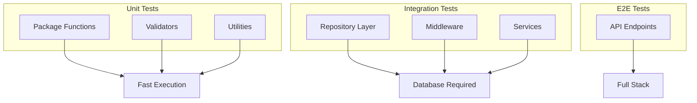

# Testing Guide

This document explains the testing approach, patterns, and best practices for the application, including unit tests, integration tests, and test utilities.

## Testing Philosophy

The application follows a pragmatic testing approach:



---

## Test Structure

```
project/
├── pkg/
│   ├── password/
│   │   └── index_test.go      # Unit tests alongside code
│   └── jwt/
│       └── index_test.go
├── internal/
│   ├── middleware/
│   │   └── identity_test.go   # Integration tests
│   └── repository/
│       └── session_repository_test.go
└── tests/
    └── integration/
        └── repository_test.go # Integration test suite
```

---

## Running Tests

### Run All Tests

```bash
go test ./...
```

### Run with Verbose Output

```bash
go test -v ./...
```

### Run Specific Package

```bash
go test ./pkg/password/...
go test ./internal/middleware/...
```

### Run Specific Test

```bash
go test -v -run TestHashPassword ./pkg/password/
go test -v -run TestAuthMiddleware ./internal/middleware/
```

### Run with Coverage

```bash
# Generate coverage report
go test -coverprofile=coverage.out ./...

# View coverage in browser
go tool cover -html=coverage.out

# View coverage by function
go tool cover -func=coverage.out
```

### Run with Race Detection

```bash
go test -race ./...
```

---

## Test Database

**Location**: `pkg/database/test_helper.go`

The test helper provides an in-memory SQLite database for testing without requiring a real PostgreSQL connection.

### InitializeTestDB

```go
func InitializeTestDB() (*gorm.DB, error)
```

Creates an in-memory SQLite database suitable for unit and integration tests.

```go
import "ovmsa-be/pkg/database"

func TestSomething(t *testing.T) {
    db, err := database.InitializeTestDB()
    if err != nil {
        t.Fatalf("Failed to initialize test DB: %v", err)
    }
    
    // Use db for testing
    db.AutoMigrate(&entities.User{})
    // ...
}
```

### Features

| Feature | Value |
|---------|-------|
| Database | SQLite in-memory |
| Caching | Shared cache for tests |
| Logging | Silent (no SQL output) |
| Compatibility | Works with GORM models |

### Usage Pattern

```go
func TestRepository(t *testing.T) {
    // 1. Initialize test database
    db, err := database.InitializeTestDB()
    if err != nil {
        t.Fatalf("Failed to initialize test DB: %v", err)
    }
    
    // 2. Initialize repositories
    repository.Initialize(db)
    
    // 3. Migrate required tables
    db.AutoMigrate(&entities.User{}, &entities.Session{})
    
    // 4. Run tests
    // ...
}
```

---

## Unit Tests

Unit tests focus on isolated functions with no external dependencies.

### Simple Unit Test

```go
// pkg/password/index_test.go

func TestValidatePasswordStrength(t *testing.T) {
    tests := []struct {
        name        string
        password    string
        expectedErr error
    }{
        {
            name:        "valid password",
            password:    "SecurePass123",
            expectedErr: nil,
        },
        {
            name:        "too short",
            password:    "Short1",
            expectedErr: ErrPasswordTooShort,
        },
        {
            name:        "no uppercase",
            password:    "securepass123",
            expectedErr: ErrPasswordNoUppercase,
        },
    }

    for _, tt := range tests {
        t.Run(tt.name, func(t *testing.T) {
            err := ValidatePasswordStrength(tt.password)
            if err != tt.expectedErr {
                t.Errorf("expected error %v, got %v", tt.expectedErr, err)
            }
        })
    }
}
```

### Table-Driven Tests

The preferred pattern for multiple test cases:

```go
func TestSlugify(t *testing.T) {
    tests := []struct {
        name     string
        input    string
        expected string
    }{
        {"simple", "Hello World", "hello-world"},
        {"special chars", "Hello@World!", "hello-world"},
        {"multiple spaces", "Test   Multiple", "test-multiple"},
        {"leading/trailing", "  Hello  ", "hello"},
    }

    for _, tt := range tests {
        t.Run(tt.name, func(t *testing.T) {
            result := Slugify(tt.input)
            if result != tt.expected {
                t.Errorf("expected %q, got %q", tt.expected, result)
            }
        })
    }
}
```

---

## Integration Tests

Integration tests verify components work together, typically involving the database.

### Repository Test

```go
// internal/repository/session_repository_test.go

func TestSessionRepository_RotateRefreshToken(t *testing.T) {
    // Setup
    db, err := database.InitializeTestDB()
    if err != nil {
        t.Fatalf("Failed to initialize test DB: %v", err)
    }
    Initialize(db)
    db.AutoMigrate(&entities.Session{})

    repo := Repo.Session
    ctx := context.Background()

    // Create test data
    session := entities.Session{
        UserID:       "user-1",
        RefreshToken: "old-hashed-token",
        ExpiresAt:    time.Now().Add(time.Hour),
    }
    session.ID = "sess-123"
    db.Create(&session)

    // Test rotation
    newToken := "new-hashed-token"
    newExpiry := time.Now().Add(2 * time.Hour)
    err = repo.RotateRefreshToken(ctx, "sess-123", "old-hashed-token", newToken, newExpiry)
    
    assert.NoError(t, err)

    // Verify
    var updated entities.Session
    db.First(&updated, "id = ?", "sess-123")
    assert.Equal(t, newToken, updated.RefreshToken)
}
```

### Middleware Test with HTTP

```go
// internal/middleware/identity_test.go

func TestAuthMiddleware_Revocation(t *testing.T) {
    // Setup
    gin.SetMode(gin.TestMode)
    os.Setenv("JWT_SECRET", "test-secret")
    config.ResetConfigForTest()
    
    db, _ := database.InitializeTestDB()
    repository.Initialize(db)
    db.AutoMigrate(&entities.Session{}, &entities.User{})

    // Create test user and session
    user := entities.User{Name: "Test User", Email: "test@example.com"}
    db.Create(&user)
    
    session := entities.Session{
        UserID:    user.ID,
        ExpiresAt: time.Now().Add(time.Hour),
    }
    session.ID = "sess-123"
    db.Create(&session)

    // Generate token
    token, _ := jwt.GenerateAccessToken(jwt.UserIdentity{
        UserID:    user.ID,
        SessionID: "sess-123",
        Audience:  "TestApp",
    })

    // Setup router
    router := gin.New()
    router.Use(AuthMiddleware())
    router.GET("/test", func(c *gin.Context) {
        c.Status(http.StatusOK)
    })

    // Test valid token
    w := httptest.NewRecorder()
    req, _ := http.NewRequest("GET", "/test", nil)
    req.Header.Set("Authorization", "Bearer "+token)
    router.ServeHTTP(w, req)
    
    assert.Equal(t, http.StatusOK, w.Code)

    // Revoke session
    db.Delete(&session)
    PurgeCaches()

    // Test revoked token
    w2 := httptest.NewRecorder()
    req2, _ := http.NewRequest("GET", "/test", nil)
    req2.Header.Set("Authorization", "Bearer "+token)
    router.ServeHTTP(w2, req2)
    
    assert.Equal(t, http.StatusUnauthorized, w2.Code)
    assert.Contains(t, w2.Body.String(), "Session has been revoked")
}
```

---

## Testing Patterns

### HTTP Handler Testing

```go
func TestHandler(t *testing.T) {
    gin.SetMode(gin.TestMode)
    
    // Setup router
    router := gin.New()
    router.GET("/endpoint", MyHandler)
    
    // Create request
    w := httptest.NewRecorder()
    req, _ := http.NewRequest("GET", "/endpoint", nil)
    
    // Execute
    router.ServeHTTP(w, req)
    
    // Assert
    assert.Equal(t, http.StatusOK, w.Code)
    assert.Contains(t, w.Body.String(), "expected content")
}
```

### JSON Body Testing

```go
func TestPostEndpoint(t *testing.T) {
    gin.SetMode(gin.TestMode)
    
    router := gin.New()
    router.POST("/users", CreateUserHandler)
    
    body := `{"email": "test@example.com", "password": "SecurePass123"}`
    req, _ := http.NewRequest("POST", "/users", strings.NewReader(body))
    req.Header.Set("Content-Type", "application/json")
    
    w := httptest.NewRecorder()
    router.ServeHTTP(w, req)
    
    assert.Equal(t, http.StatusCreated, w.Code)
}
```

### Context Testing

```go
func TestWithIdentity(t *testing.T) {
    // Create identity
    identity := &entities.Identity{
        UserID: "user-123",
        OrgID:  "org-456",
        Role:   "admin",
    }
    
    // Create context with identity
    ctx := context.WithValue(context.Background(), identityCtxKey{}, identity)
    
    // Retrieve identity
    retrieved := entities.GetIdentity(ctx)
    assert.Equal(t, identity.UserID, retrieved.UserID)
}
```

### Cache Purging

When testing middleware that uses caches, purge caches between tests:

```go
func TestAuthMiddleware(t *testing.T) {
    // Purge all caches before test
    middleware.PurgeCaches()
    
    // Run test...
    
    // Purge after test for clean state
    t.Cleanup(func() {
        middleware.PurgeCaches()
    })
}
```

---

## Assertions

### Using stretchr/testify

```go
import "github.com/stretchr/testify/assert"

func TestExample(t *testing.T) {
    // Equality
    assert.Equal(t, expected, actual)
    assert.NotEqual(t, unexpected, actual)
    
    // Boolean
    assert.True(t, condition)
    assert.False(t, condition)
    
    // Nil/Error
    assert.Nil(t, err)
    assert.NoError(t, err)
    assert.Error(t, err)
    assert.ErrorIs(t, err, specificError)
    assert.ErrorContains(t, err, "substring")
    
    // Collections
    assert.Len(t, slice, 3)
    assert.Contains(t, slice, element)
    assert.Empty(t, slice)
    
    // Type
    assert.IsType(t, &MyType{}, actual)
    
    // HTTP
    assert.Equal(t, http.StatusOK, w.Code)
    assert.Contains(t, w.Body.String(), "expected")
    
    // Time
    assert.WithinDuration(t, expected, actual, time.Second)
}
```

### Standard Library

```go
func TestExample(t *testing.T) {
    // Equality
    if actual != expected {
        t.Errorf("expected %v, got %v", expected, actual)
    }
    
    // Error
    if err != nil {
        t.Fatalf("unexpected error: %v", err)
    }
}
```

---

## Test Configuration

### Environment Setup

```go
func TestMain(m *testing.M) {
    // Setup environment
    os.Setenv("APP_NAME", "TestApp")
    os.Setenv("JWT_SECRET", "test-secret")
    os.Setenv("ENVIRONMENT", "test")
    
    // Initialize config
    config.ResetConfigForTest()
    logger.Initialize(config.EnvDevelopment)
    
    // Run tests
    os.Exit(m.Run())
}
```

### Per-Test Setup

```go
func TestSomething(t *testing.T) {
    t.Cleanup(func() {
        // Cleanup after test
        middleware.PurgeCaches()
    })
    
    // Test code...
}
```

---

## Best Practices

### Do

```go
// Use table-driven tests
func TestFunction(t *testing.T) {
    tests := []struct {
        name string
        // ...
    }{
        // cases...
    }
    for _, tt := range tests {
        t.Run(tt.name, func(t *testing.T) {
            // test
        })
    }
}

// Use meaningful test names
{"valid email returns true", "test@example.com", true},
{"invalid email returns false", "not-an-email", false},

// Clean up resources
t.Cleanup(func() {
    db.Close()
})

// Use httptest for HTTP tests
w := httptest.NewRecorder()
req := httptest.NewRequest("GET", "/path", nil)
```

### Don't

```go
// Don't use t.Error when test should stop
if err != nil {
    t.Error("error occurred")  // Wrong - continues execution
}

// Use t.Fatal for unrecoverable errors
if err != nil {
    t.Fatalf("failed to setup: %v", err)  // Correct
}

// Don't share state between tests
var globalDB *gorm.DB  // Wrong - shared state

// Use local setup
func TestSomething(t *testing.T) {
    db := setupTestDB(t)  // Correct - isolated
}

// Don't skip cleanup
func TestSomething(t *testing.T) {
    db, _ := database.InitializeTestDB()
    // Missing cleanup - wrong
}
```

---

## Test Coverage Goals

| Layer | Target Coverage |
|-------|-----------------|
| Utilities (pkg/utils) | 90%+ |
| Password/Crypto | 90%+ |
| Validators | 80%+ |
| Repositories | 70%+ |
| Services | 60%+ |
| Middleware | 70%+ |
| Handlers | 50%+ |

---

## Continuous Integration

### GitHub Actions Example

```yaml
name: Tests

on: [push, pull_request]

jobs:
  test:
    runs-on: ubuntu-latest
    steps:
      - uses: actions/checkout@v3
      
      - name: Set up Go
        uses: actions/setup-go@v4
        with:
          go-version: '1.21'
      
      - name: Run tests
        run: go test -v -race -coverprofile=coverage.out ./...
      
      - name: Upload coverage
        uses: codecov/codecov-action@v3
        with:
          file: ./coverage.out
```

---

## Debugging Tests

### Verbose Output

```bash
go test -v -run TestSpecificCase ./path/to/package
```

### Print Debugging

```go
t.Logf("Debug: %+v", object)
t.Logf("SQL: %s", query)
```

### Using Delve

```bash
# Install delve
go install github.com/go-delve/delve/cmd/dlv@latest

# Debug test
dlv test ./path/to/package -- -test.run TestSpecificCase
```

### Race Detection

```bash
go test -race ./...
```

Fix all race conditions before merging.
