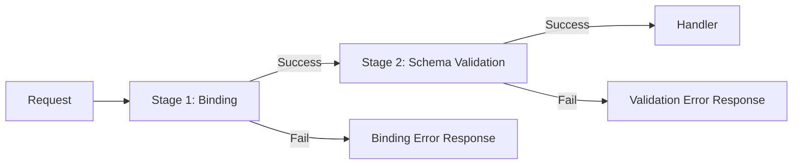

# Request Validation System

This document explains the request validation system, including the two-stage validation process, validation tags, error formatting, and best practices.

## Overview

The application uses a two-stage validation approach:



1. **Stage 1 - Binding**: Parses JSON/form data into Go structs (catches malformed JSON, wrong types)
2. **Stage 2 - Schema Validation**: Validates business rules using `validate` tags (catches invalid emails, short passwords, etc.)

---

## Two-Stage Validation

### Why Two Stages?

| Stage | Purpose | Example Error |
|-------|---------|---------------|
| Binding | Parse raw request into Go struct | Malformed JSON, string in int field |
| Schema | Validate business rules | Invalid email, password too short |

This separation provides:
- **Clearer error messages** - Users know if their JSON is broken vs. data is invalid
- **Better debugging** - Developers can distinguish parse errors from validation errors
- **Security** - Invalid data is rejected before reaching business logic

### Implementation

**Location**: `internal/api/index.go`

```go
// Stage 1: Binding
err := c.ShouldBind(payload)
if err != nil {
    validationErrors := formatValidationErrors(err)
    response.ValidationErrorWithDetailsResponse(c, err, "Payload binding error", validationErrors)
    return
}

// Stage 2: Schema Validation
if routeMatrix.Schema != nil {
    validate := validatorHelper.GetValidator()
    err := validate.Struct(payload)
    if err != nil {
        validationErrors := formatValidationErrors(err)
        response.ValidationErrorWithDetailsResponse(c, err, "Payload validation error", validationErrors)
        return
    }
}
```

---

## Validation Tags

The system uses `go-playground/validator` with the `validate` struct tag.

### Common Validation Tags

| Tag | Purpose | Example |
|-----|---------|---------|
| `required` | Field must be present | `validate:"required"` |
| `email` | Must be valid email | `validate:"email"` |
| `min` | Minimum length/value | `validate:"min=8"` |
| `max` | Maximum length/value | `validate:"max=100"` |
| `len` | Exact length | `validate:"len=26"` |
| `oneof` | Must be one of values | `validate:"oneof=red green blue"` |
| `url` | Must be valid URL | `validate:"url"` |
| `alphanum` | Only letters and numbers | `validate:"alphanum"` |
| `numeric` | Must be numeric string | `validate:"numeric"` |
| `omitempty` | Skip validation if empty | `validate:"omitempty,email"` |

### Defining Request Schemas

Create validation structs in `*.validate.go` files:

```go
// internal/api/v1.0/ovmsa/auth/auth.validate.go

type LoginRequest struct {
    Email    string `json:"email" binding:"required" validate:"required,email"`
    Password string `json:"password" binding:"required" validate:"required,min=8"`
}

type RefreshTokenRequest struct {
    RefreshToken string `json:"refresh_token" binding:"required" validate:"required"`
    Audience     string `json:"audience,omitempty" validate:"omitempty,oneof=web mobile"`
}

type CreateOrganizationRequest struct {
    Name     string  `json:"name" validate:"required,min=2,max=100"`
    ParentID *string `json:"parent_id" validate:"omitempty,len=26"`
    Tier     string  `json:"tier" validate:"omitempty,oneof=free basic enterprise"`
}
```

### Tag Details

#### `required`
```go
Name string `validate:"required"`
// Error: "This field is required"
```

#### `email`
```go
Email string `validate:"email"`
// Error: "Must be a valid email address"
```

#### `min` and `max`
```go
// For strings: character count
Password string `validate:"min=8,max=72"`
// Error: "Must be at least 8 characters"

// For numbers: value comparison
Age int `validate:"min=18,max=120"`
// Error: "Value must be at least 18"
```

#### `oneof`
```go
Status string `validate:"oneof=active inactive pending"`
// Error: "Must be one of [active inactive pending]"
```

#### `len`
```go
ID string `validate:"len=26"`
// Error: "Length must be exactly 26"
```

#### Combining Tags
```go
Email string `json:"email" validate:"required,email"`
Name  string `json:"name" validate:"required,min=2,max=100"`
```

---

## Error Formatting

**Location**: `pkg/validator/formatter.go`

### Formatter Registry

The system uses a registry pattern for consistent, user-friendly error messages.

```go
registry := validatorHelper.GetFormatterRegistry()
errors := registry.FormatAll(err)
// Returns: {"email": "Must be a valid email address", "password": "Must be at least 8 characters"}
```

### Built-in Formatters

| Tag | Formatter | Message |
|-----|-----------|---------|
| `required` | `RequiredFormatter` | "This field is required" |
| `email` | `EmailFormatter` | "Must be a valid email address" |
| `min` | `MinFormatter` | "Must be at least X characters" or "Value must be at least X" |
| `max` | `MaxFormatter` | "Must be no more than X characters" or "Value must be no more than X" |
| `url` | `URLFormatter` | "Must be a valid URL" |
| `oneof` | `OneOfFormatter` | "Must be one of [options]" |
| `len` | `LenFormatter` | "Length must be exactly X" |
| `alphanum` | `AlphanumFormatter` | "Must contain only letters and numbers" |
| `numeric` | `NumericFormatter` | "Must be a valid number" |

### Custom Formatters

Create custom formatters for domain-specific validation:

```go
// 1. Define the formatter
type PasswordFormatter struct{}

func (f *PasswordFormatter) Format(err validator.FieldError) string {
    return "Password must contain uppercase, lowercase, number, and special character"
}

// 2. Register it
registry := validatorHelper.GetFormatterRegistry()
registry.Register("password_strength", &PasswordFormatter{})

// 3. Use in struct
type CreateUserRequest struct {
    Password string `validate:"password_strength"`
}
```

---

## Validator Initialization

**Location**: `pkg/validator/index.go`

```go
func InitValidator() {
    payloadValidator = validator.New(validator.WithRequiredStructEnabled())

    // Use JSON tag names in error messages
    payloadValidator.RegisterTagNameFunc(func(fld reflect.StructField) string {
        name := strings.SplitN(fld.Tag.Get("json"), ",", 2)[0]
        if name == "-" {
            return ""
        }
        return name
    })
}
```

The validator is initialized at application startup and uses JSON tag names for error field names.

---

## Response Format

### Successful Validation

Request proceeds to handler with validated payload.

### Validation Error Response

```json
{
    "success": false,
    "data": null,
    "error": {
        "code": "VALIDATION_ERROR",
        "message": "Payload validation error",
        "type": "ValidationError",
        "details": {
            "email": "Must be a valid email address",
            "password": "Must be at least 8 characters"
        }
    }
}
```

### Binding Error Response

```json
{
    "success": false,
    "data": null,
    "error": {
        "code": "VALIDATION_ERROR",
        "message": "Payload binding error",
        "type": "ValidationError",
        "details": {
            "age": "expected type 'int', got unconvertible type 'string'"
        }
    }
}
```

---

## Handler-Returned Validation Errors

Handlers can return validation errors for business-logic validation:

```go
func LoginHandler(c *gin.Context, payload any, identity *entities.Identity, params map[string]string) (any, error, error) {
    req := payload.(*LoginRequest)
    
    user, err := authService.Login(req.Email, req.Password)
    if err != nil {
        return nil, err, nil  // Regular error
    }
    
    // Business validation
    if user.IsLocked {
        return nil, nil, errors.New("account is locked")  // Validation error
    }
    
    return user, nil, nil
}
```

The third return value is treated as a validation error and formatted accordingly.

---

## Custom Validation Rules

### Registering Custom Validators

```go
func init() {
    v := validatorHelper.GetValidator()
    
    // Register custom validator
    v.RegisterValidation("strong_password", func(fl validator.FieldLevel) bool {
        password := fl.Field().String()
        hasUpper := regexp.MustCompile(`[A-Z]`).MatchString(password)
        hasLower := regexp.MustCompile(`[a-z]`).MatchString(password)
        hasNumber := regexp.MustCompile(`[0-9]`).MatchString(password)
        hasSpecial := regexp.MustCompile(`[!@#$%^&*]`).MatchString(password)
        return hasUpper && hasLower && hasNumber && hasSpecial
    })
}
```

### Using Custom Validators

```go
type CreateUserRequest struct {
    Password string `validate:"required,min=12,strong_password"`
}
```

---

## Best Practices

### Do

```go
// Use descriptive JSON tags
type CreateUserRequest struct {
    Email    string `json:"email" validate:"required,email"`
    Password string `json:"password" validate:"required,min=8"`
}

// Group related validations
type Address struct {
    Street  string `validate:"required"`
    City    string `validate:"required"`
    Country string `validate:"required,len=2"` // ISO country code
}

// Use omitempty for optional fields
type UpdateUserRequest struct {
    Name  string `json:"name" validate:"omitempty,min=2"`
    Email string `json:"email" validate:"omitempty,email"`
}
```

### Don't

```go
// Don't skip validation
type CreateUserRequest struct {
    Email string `json:"email"` // No validation!
}

// Don't use confusing tag combinations
type Request struct {
    Field string `validate:"required,omitempty"` // Contradictory!
}

// Don't put business logic in validators
// Use handler-level validation for database checks
type CreateUserRequest struct {
    Email string `validate:"unique_in_database"` // Wrong approach
}
```

---

## Testing Validation

### Unit Testing Schemas

```go
func TestLoginRequestValidation(t *testing.T) {
    v := validatorHelper.GetValidator()
    
    tests := []struct {
        name    string
        request LoginRequest
        wantErr bool
    }{
        {
            name: "valid request",
            request: LoginRequest{
                Email:    "user@example.com",
                Password: "password123",
            },
            wantErr: false,
        },
        {
            name: "invalid email",
            request: LoginRequest{
                Email:    "not-an-email",
                Password: "password123",
            },
            wantErr: true,
        },
        {
            name: "short password",
            request: LoginRequest{
                Email:    "user@example.com",
                Password: "short",
            },
            wantErr: true,
        },
    }
    
    for _, tt := range tests {
        t.Run(tt.name, func(t *testing.T) {
            err := v.Struct(tt.request)
            if (err != nil) != tt.wantErr {
                t.Errorf("expected error: %v, got: %v", tt.wantErr, err)
            }
        })
    }
}
```

### Integration Testing

```go
func TestLoginEndpointValidation(t *testing.T) {
    // Test with invalid payload
    body := `{"email": "invalid", "password": "short"}`
    req := httptest.NewRequest("POST", "/auth/login", strings.NewReader(body))
    req.Header.Set("Content-Type", "application/json")
    
    // Execute request and check response
    // Should return 422 with validation details
}
```

---

## Common Validation Scenarios

### Email Validation
```go
Email string `validate:"required,email"`
```

### Password Validation
```go
Password string `validate:"required,min=8,max=72"`
```

### Phone Number
```go
Phone string `validate:"required,e164"` // Requires custom e164 validator
```

### Date Range
```go
type DateRange struct {
    StartDate time.Time `validate:"required"`
    EndDate   time.Time `validate:"required,gtfield=StartDate"`
}
```

### Conditional Validation
```go
type PaymentRequest struct {
    Method   string  `validate:"required,oneof=card bank"`
    CardNumber string `validate:"required_if=Method=card"`
}
// Note: required_if needs custom implementation or use omitempty with business logic
```

### Array Validation
```go
Tags []string `validate:"required,min=1,max=5,dive,min=2,max=20"`
// dive applies validation to each element
```
